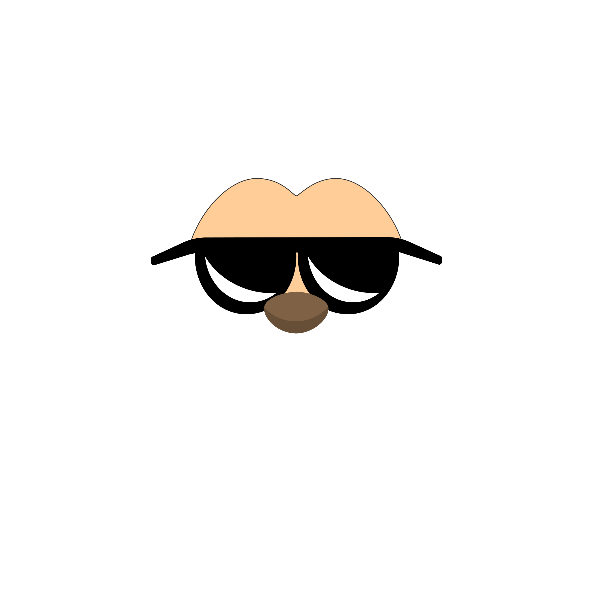
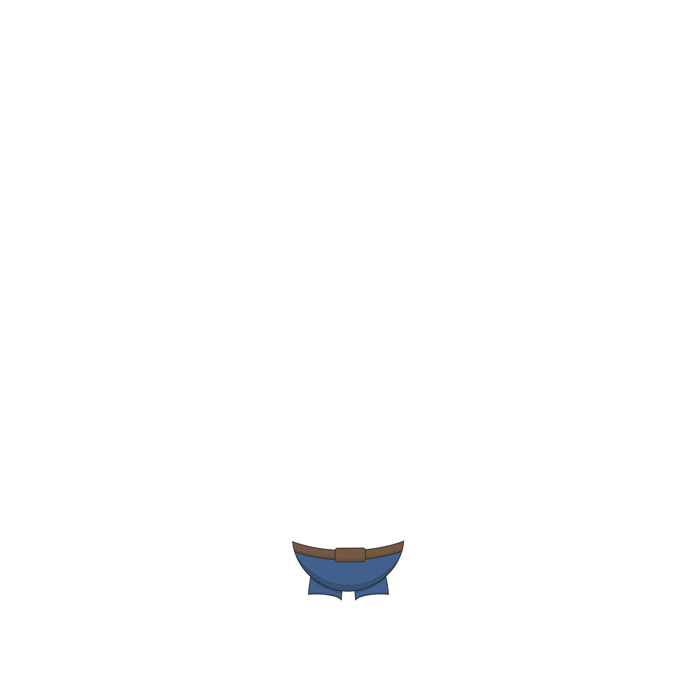
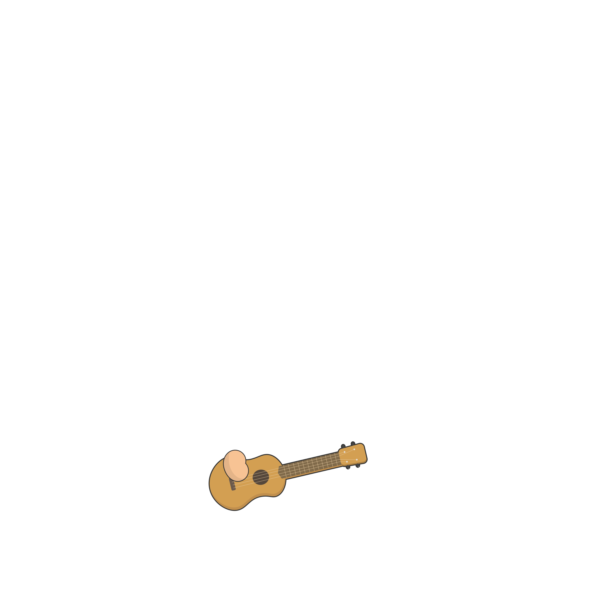

# SVG Image Utils


SVG Image Utils is a lightweight Python SVG parser that focuses on correctly layering SVG images


When appending SVGs, the name selectors in the style tag and class paths are the same in both the base template and the appended SVG images.
As a result, an abnormal looking SVG image will be created.

SVG Image Utils modifies attributes that contradict each other between all the appended SVGs and thus outputs a
new, intuitive looking layered SVG image.


## Usage

Install `svgimgutils`:

```
$ pip install --save svgimgutils
```


## Example

We will stack SVG images over the following SVG image:

<p align="center">
  <h2> Base template: </h2>
  
</p>
This monkey is in a need for customization.
The SVG images we will append are as following:

<p align="center">
  <h2> Hat: </h2>
  
</p>

<p align="center">
  <h2> Mouth: </h2>
  
</p>

<p align="center">
  <h2> Glasses: </h2>
  
</p>

<p align="center">
  <h2> Pants: </h2>
  
</p>

<p align="center">
  <h2> Shoes: </h2>
  
</p>

<p align="center">
  <h2> Misc: </h2>
  
</p>

<p align="center">
  <h2> Tail: </h2>
  
</p>

The following snippet will create an SVG appender for each SVG image and will append them onto the base template appender.

```
    from svgimgutils import SVGImgUtils as SVGIU


    # Create SVG Image Utils for each SVG image
    base_template = SVGIU.fromfile('Images/monkey.svg')
    pants = SVGIU.fromfile('Images/pants.svg')
    shoes = SVGIU.fromfile('Images/shoes.svg')
    tail = SVGIU.fromfile('Images/tail.svg')
    mouth = SVGIU.fromfile('Images/mouth.svg')
    glasses = SVGIU.fromfile('Images/glasses.svg')
    hat = SVGIU.fromfile('Images/hat.svg')
    misc = SVGIU.fromfile('Images/misc.svg')

    # Append SVG images onto base template
    base_template.append(pants)
    base_template.append(shoes)
    base_template.append(tail)
    base_template.append(mouth)
    base_template.append(glasses)
    base_template.append(hat)
    base_template.append(misc)

    # Save new merged SVG image
    base_template.save('Images/merged.svg')
```

This will result in a new "merged" svg image:

<p align="center">
  <h2> Result: </h2>
  
</p>

## License

This project is licensed under the MIT License - see the [LICENSE.md](LICENSE.md) file for details
